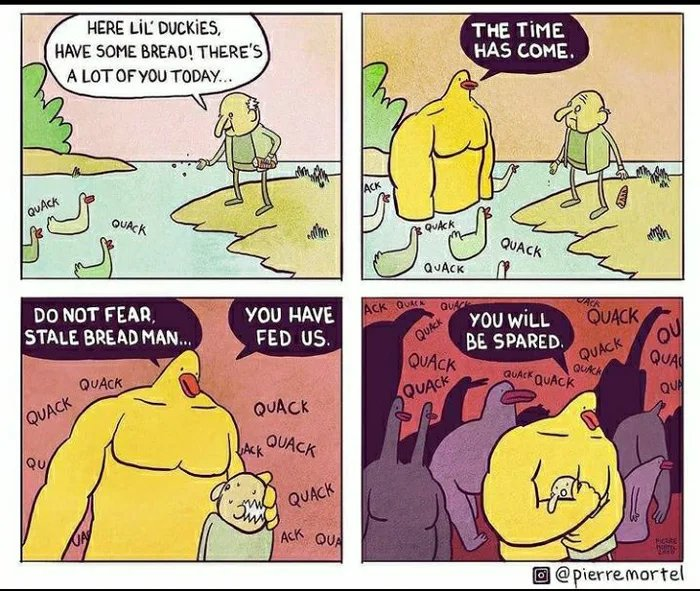
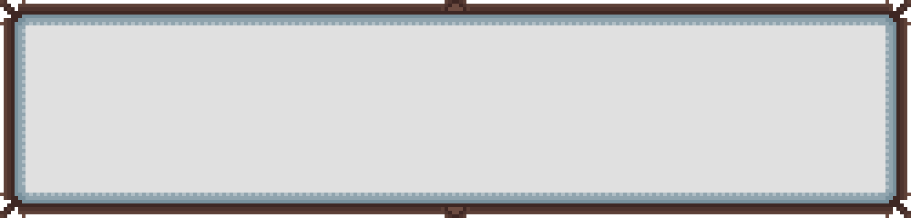
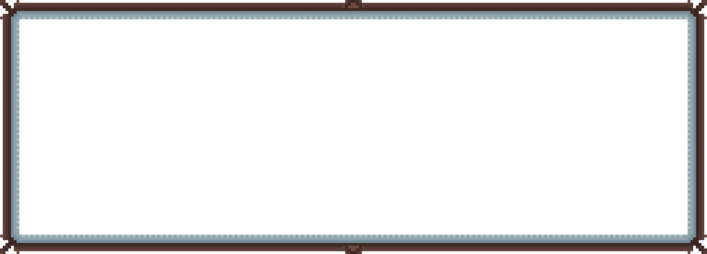
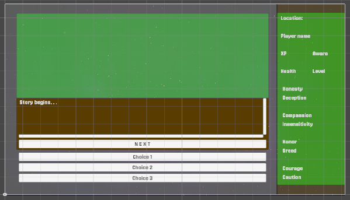

Starting with Phase 2 . We focus on the remaining parts of the blueprint. 
Having a loose sense of structure of the whole project is certainly advantageous and even if there are changes, its still better than a confused approach in my opinion. 

## <mark style="background: #ADCCFFA6;">UIManager</mark>
The **UIManager** will handle displaying the dialogue text and choices on the screen. **TextMeshPro** for text rendering and **UI Buttons** for choices.

I set up a neat background image and some panels based on the ratio this mockup was designed. These panels will display data based on the scripts. 

I acquired the font asset from [google fonts](https://fonts.google.com/selection?query=pixel+) and utilized it in TextMeshPro but a better pixely feel. 
**Import your font file:**    
- Download a font file (TTF or OTF) from a source like Google Fonts. 
- Drag and drop the font file into your Unity project's Assets folder. 
**Open the Font Asset Creator:**    
- Go to Window > TextMeshPro > Font Asset Creator.     
**Create the font asset:**    
- In the Font Asset Creator window, select your imported font file as the "Source Font File". 
- Adjust settings like "Sampling Point Size" depending on your needs. 
- Click "Generate Font Atlas" to create the texture atlas for your font.     
**Assign the font to your TextMeshPro object:**    
- Select your TextMeshPro GameObject in the Hierarchy. 
- In the Inspector window, navigate to the "Font" property and drag your newly created font asset onto it.
With some custom anchoring. I hope the hard work would pay off when working with different builds. 

Some minor code adjustments to link up the Assets and UI elements with the existing code base. Pretty time consuming to debug. 

This is the image for the current version of UI, the basic functionality has been achieved. 
I have decided to regard these only as a reference, to get a gist of ideas and decision i took. I have to say this because just this week coding assistants are freely available. Also there are so many changes happening in a go, i take 2 step forward to take 1 step backward because some functionality i thought i could achieve is a bad way to do it; AI is really transforming this scene. And these steps seem very pointless. 
Documentation is just 1 sentence away. So i have decided to use the dev log only as a reference for decisions than rather explanation of the code as a whole. Like they are supposed to be.
Also, i intend to offer my thanks and praise to the AI overlords for helping me with this, this would not have been possible without deepseek, perplexity and gemini. (gpt-4o actually wasn't very helpful)

**Some major changes done are.** 
- Creating the UI system in scene and linking it with respective scripts, method and events. 
- Displaying dialogue, handling choices, and advancing the story.
- Displaying and updating the player's stats (Name, Level, XP, Health) in the UI panel.
- Testing for all of this.
- A good amount of refactoring. 

Next phase will focus on developing the story and linking it with the quest system. 
There is a need to develop the fighting system, but that can be done in the next cycle.

26 April 2025

A good amount of time has passed, I have managed to learn a bit about pixel art and based on that, have created some basic UI elements and incorporated them into the design. 

I also thought a bit about the whole only text based adventure and for some reason it didnt feel right, or marketable. With so much AI gen slop and the vibe coding fanatics, games with little effort seem a bit lazy and unsellable to me. So, i believe to put in a but more effort and consider this as a step towards success even if it fails or whatever. 

So, There will be a image window added, i also think faces along the dialogues would be cool. 
Here are so0me assets. 

It did take some time and effort to get hold of generating and linking them with UI elements. But i succeeded in the end. The LLM instructions were not thorough. Well anyways. 

I also revamped the UI to have a section for image, and to accommodate that, there was a need to utilize the whole 1920x1080 screen. 
Keeping the sidebar intact was a design decision which i still have incorporated, though i think i can make it collapsible later. 

And after asset integration this is the current version.

I will design the buttons later, also the right side needs a lot of bars and removal of some things. But current task is to have a rough idea about the images that i need. 

I am trying to limit the use of AI as much as possible for artistic needs at least. Though coding is not possible without AI, since it would be stupid of me to not use it. 

Will push today. 
